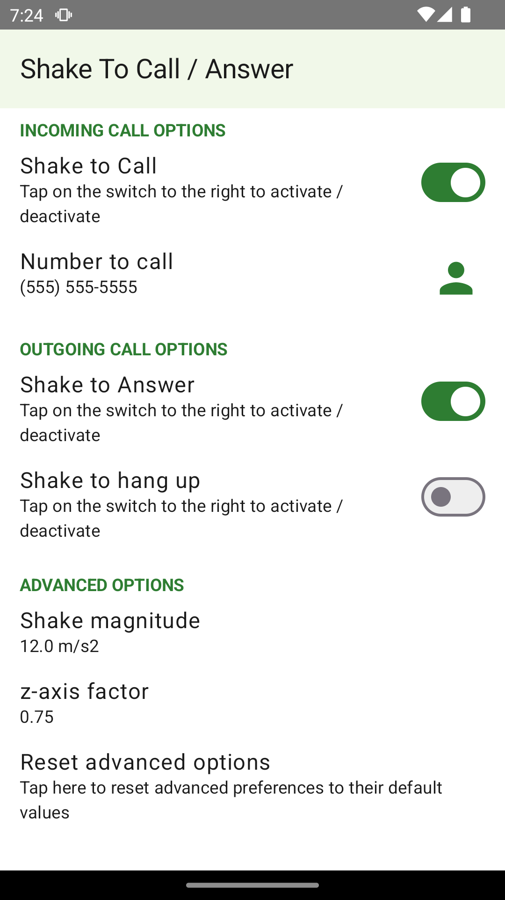
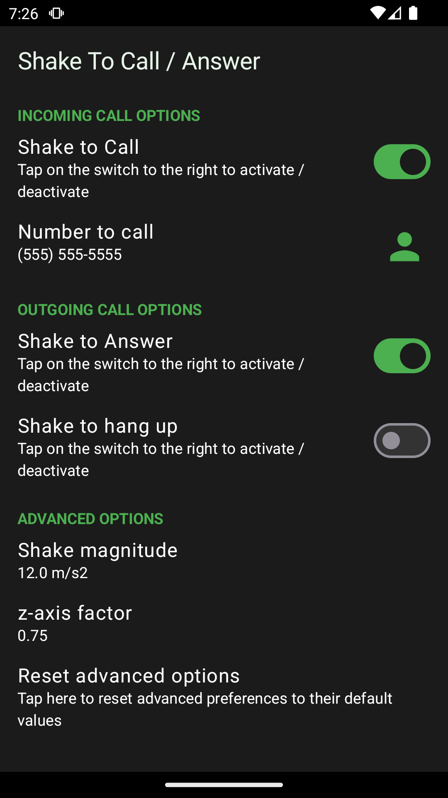

*In loving memory of my father, who battled glaucoma during the last years of his life.*

---

# Shake to Call / Answer / Hangup

This is an Android app designed specifically for users with very low vision.
The app offers intuitive features to simplify call handling:

- Shake your phone to call a predefined number
- Shake your phone to answer an incoming call
- Shake your phone to end an ongoing call

## Disclaimer
This Android application and its source code are provided "as is" without warranty of any kind, express or implied, including but not limited to the warranties of merchantability, fitness for a particular purpose, or non-infringement. 
Use at your own risk. The authors are not liable for any damages or issues arising from the use of this software.

## Required Permissions

- Telephone permissions: Required to make and answer calls, as well as to detect the phone's state (e.g., call in progress).
- Notification permissions: Used to allow the app to run in the background as a service. This functionality is active only when at least one feature switch is enabled.
- Contacts permission (optional): Allows the user to select the default phone number from their contact list.

## Screenshots

